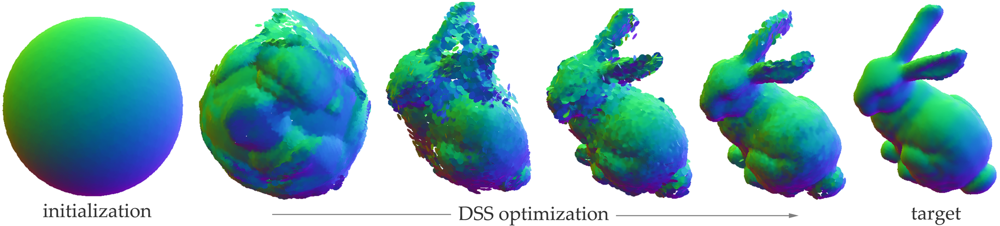
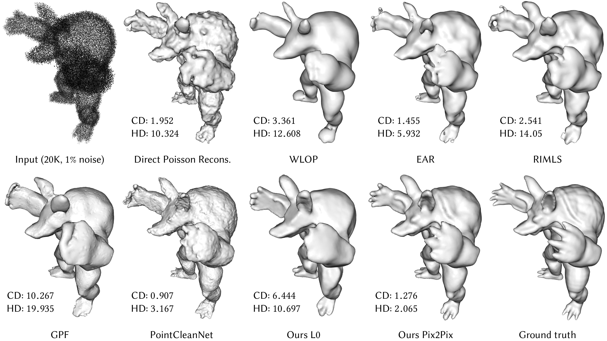
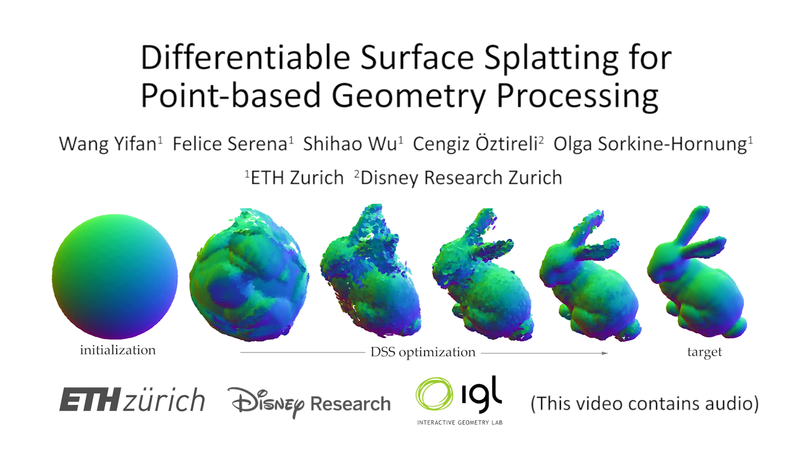

# DSS: Differentiable Surface Splatting
| [Paper PDF](https://igl.ethz.ch/projects/differentiable-surface-splatting/DSS-2019-SA-Yifan-etal.pdf) | [Project page](https://igl.ethz.ch/projects/differentiable-surface-splatting/) |
| ----------------------------------------- | ------------------------------------------------------------------------------ |



code for paper Differentiable Surface Splatting for Point-based Geometry Processing

```diff
+ Mar 2021: major updates tag 2.0.
+ > Now supports simultaneous normal and point position updates.
+ > Unified learning rate using Adam optimizer.
+ > Highly optimized cuda operations
+ > Shares pytorch3d structure
```
- [DSS: Differentiable Surface Splatting](#dss-differentiable-surface-splatting)
  - [Installation](#installation)
  - [Demos](#demos)
    - [inverse rendering - shape deformation](#inverse-rendering---shape-deformation)
    - [~~denoising (TBA)~~](#denoising-tba)
  - [video](#video)
  - [cite](#cite)
  - [Acknowledgement](#acknowledgement)
## Installation
1. install prequisitories. Our code uses python3.8, pytorch 1.6.1, pytorch3d. the installation instruction requires the latest anaconda.
```bash
# install cuda, cudnn, nccl from nvidia
# we tested with cuda 10.2 and pytorch 1.6.0
# update conda
conda update -n base -c defaults conda
# install requirements
conda create -n pytorch3d python=3.8
conda config --add channels pytorch
conda config --add channels conda-forge
conda activate pytorch3d
conda install -c pytorch pytorch=1.6.0 torchvision cudatoolkit=10.2
conda install -c conda-forge -c fvcore -c iopath fvcore iopath
conda install -c bottler nvidiacub
conda install pytorch3d -c pytorch3d
conda install --file requirements.txt
pip install "git+https://github.com/mmolero/pypoisson.git"
```
2. clone and compile
```bash
git clone --recursive https://github.com/yifita/DSS.git
cd dss
# compile external dependencies
cd external/prefix
python setup.py install
cd ../FRNN
python setup.py install
cd ../torch-batch-svd
python setup.py install
# compile library
cd ../..
python setup.py develop
```
## Demos
### inverse rendering - shape deformation

```bash
# create mvr images using intrinsics defined in the script
python scripts/create_mvr_data_from_mesh.py --points example_data/mesh/yoga6.ply --output example_data/images --num_cameras 128 --image-size 512 --tri_color_light --point_lights --has_specular

python train_mvr.py --config configs/dss.yml
```
Check the optimization process in tensorboard.
```
tensorboard --logdir=exp/dss_proj
```

### ~~denoising (TBA)~~
We will add back this function ASAP.




## video
[](https://youtu.be/MIu59GiJZ2s "Accompanying video")
<!-- [Accompanying video](https://youtu.be/Q8iTkmIky0o) -->

## cite
Please cite us if you find the code useful!
```
@article{Yifan:DSS:2019,
author = {Yifan, Wang and
          Serena, Felice and
          Wu, Shihao and
          {\"{O}}ztireli, Cengiz and
         Sorkine{-}Hornung, Olga},
title = {Differentiable Surface Splatting for Point-based Geometry Processing},
journal = {ACM Transactions on Graphics (proceedings of ACM SIGGRAPH ASIA)},
volume = {38},
number = {6},
year = {2019},
}
```

## Acknowledgement
We would like to thank Federico Danieli for the insightful discussion, Phillipp Herholz for the timely feedack, Romann Weber for the video voice-over and Derek Liu for the help during the rebuttal.
This work was supported in part by gifts from Adobe, Facebook and Snap, Inc.
