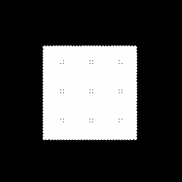

## DSS: Differentiable Surface Splatting

### Demo
````bash
git clone --recursive 

cd pytorch_points
conda create --name DSS --file requirements.txt

python setup.py install
cd ..
python setup.py install # or python setup develop for local compilation

# downloads
cd trained_models
./download_data.sh

# inverse rendering test: optimize point positions and normals to transform sphere to teapot
python learn_shape_from_target.py example_data/scenes/sphere.json -t example_data/scenes/teapot.json

# denoising
python learn_image_filter.py example_data/scenes/pix2pix_denoise.json --cloud example_data/pointclouds/noisy03_points/a72-seated_jew_aligned_pca.ply

python learn_image_filter.py example_data/scenes/pix2pix_denoise_noise01.json --cloud example_data/noisy1_points/a72-seated_jew_aligned_pca.ply
````

### Results

#### 2D grid to teapot


#### 3D sphere to teapot


#### Denoising
